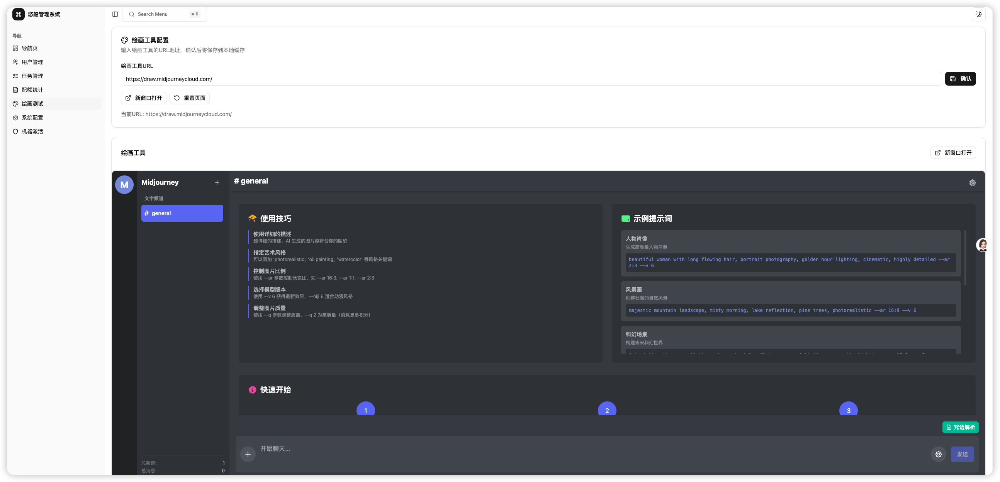

# 🎨 悠船代理 Pro - 企业级 AI 创作平台

## 📅 更新日志

| 时间       | 更新内容                                             |
| ---------- | ---------------------------------------------------- |
| 2025-07-27 | 增加对于chat格式的生图和视频支持，目前生图可通过上下文对话进行修改图 |

**🎉 已稳定生成数百万张图像 | 🔥 高颜值移动端完美适配**

## 💰 特惠价格

🔥 **限时优惠** 🔥

**赞助费最低仅需 ¥299！目前赞助价格399/人,可3人成团，低至299/人！！！**

*超高性价比 · 企业级稳定服务 · 立即享受数百万张图像验证的AI创作平台*

## 🚀 产品概述

**悠船代理 Pro** 是一款经过数百万张图像生成验证的企业级 MidJourney 代理服务系统。凭借卓越的稳定性和高颜值的移动端界面设计，为开发者和企业提供完整的 AI 图像与视频生成解决方案。

### 🎯 核心优势
- ✅ **超高稳定性** - 已成功处理数百万张图像生成请求
- 📱 **移动端优化** - 高颜值UI设计，完美适配各种移动设备
- 🔧 **企业级架构** - 高可用、高并发、易扩展的系统设计
- 🚀 **即开即用** - 完整的部署方案，快速上线

### 🎮 在线体验

🌐 **体验地址**: [http://demo.midjourneycloud.com/](http://demo.midjourneycloud.com/)

🔑 **测试账号**: `magicai` | **密码**: `magicai.`

### 🚀 官方生图站点
慢速渠道惊爆价，4分起步，量越大优惠越大！！！

🎨 **悠船生图渠道**: [https://proxy.midjourneycloud.com/](https://proxy.midjourneycloud.com/)

🎨 **合作伙伴**: [https://kk2.deepwl.net/](https://kk2.deepwl.net/)

*稳定的悠船生图渠道 - 基于本系统搭建的官方服务站点*

---

## 📱 产品截图

### 📊 系统监控面板

### 🎨 绘图创作界面

### 📋 任务管理中心

### 👥 用户管理系统

### 📱 移动端界面预览

#### 🎨 移动端绘图界面

#### 📋 移动端任务管理

#### 📊 移动端统计面板

#### 👤 移动端用户中心

---

## ✨ 核心特性

### 🎛️ 灵活配置系统
- **模块化配置**: 支持图片大小、返回方式、代理设置等独立配置
- **实时生效**: 配置修改后立即生效，无需重启服务
- **多维度组合**: 图片大小模式 × 返回方式 × 代理设置，灵活组合满足不同场景需求
- **环境变量支持**: 敏感配置支持环境变量，提升部署安全性

### 🔗 完美MJP接口适配
- **100% API兼容**: 完全兼容 MidJourney Plus 官方接口规范
- **多版本支持**: 支持 MJ5/MJ6/MJ7 和 NIJI5/NIJI6 等多个版本
- **自定义按钮**: 支持各版本专属的操作按钮模板定制
- **无缝迁移**: 现有MJP项目可零成本迁移

### 🎬 全面创作支持
- **核心指令**: 完整支持 Imagine 指令及所有关联动作 [V1/V2/V3/V4/U1/U2/U3/U4/R]
- **图片处理**: 支持 Blend (图片混合)、Describe (图生文)、Shorten (提示词分析) 等专业指令
- **垫图功能**: Imagine 指令支持 base64 图片输入作为参考图像
- **视频创作**: 全面支持 MJ 视频生成，包含文生视频、图生视频等多种模式
- **实时追踪**: 任务执行全程实时进度反馈，支持状态监控

### 🎨 高级创作功能
- **智能翻译**: 内置中文 prompt 智能翻译，支持 DEEPL 高质量翻译服务
- **内容审核**: prompt 敏感词智能预检测，支持自定义词库动态调整
- **精细操作**: 支持焦点移动 Pan ⬅️➡⬆️⬇️、局部重绘 Vary (Region) 🖌️
- **变焦控制**: 完整的图片变焦功能，支持自定义 Zoom 🔍 操作
- **种子获取**: 支持提取图片 seed 值，便于复现和调优
## 🎯 技术架构

### 🏗️ 系统优势
- **🔒 企业级稳定性** - 7×24小时稳定运行，已验证数百万张图像生成
- **📈 高并发处理** - 支持大规模并发请求，智能负载均衡
- **🔄 实时同步** - 任务状态实时更新，完整的进度追踪
- **🛡️ 安全可靠** - 多重安全机制，数据加密传输

### 📊 性能数据
- ✅ **累计生成**: 数百万张高质量图像
- ⚡ **响应速度**: 平均响应时间 < 2s
- 🔄 **成功率**: 99.5% 的任务成功率
- 📱 **设备兼容**: 100% 移动端完美适配

---

## 📞 联系我们

**💬 微信咨询**

*扫码添加微信，获取专业技术支持与商务合作*

<table>
<tr>
<td align="center">
 
<b>技术支持</b> 
专业技术咨询
</td>
<td align="center">
 
<b>商务合作</b> 
定制开发服务
</td>
</tr>
</table>

---

**🎨 悠船代理 Pro - 数百万张图像验证的稳定AI创作平台**

*高颜值 · 移动适配 · 企业级稳定 · 超值¥299起*

